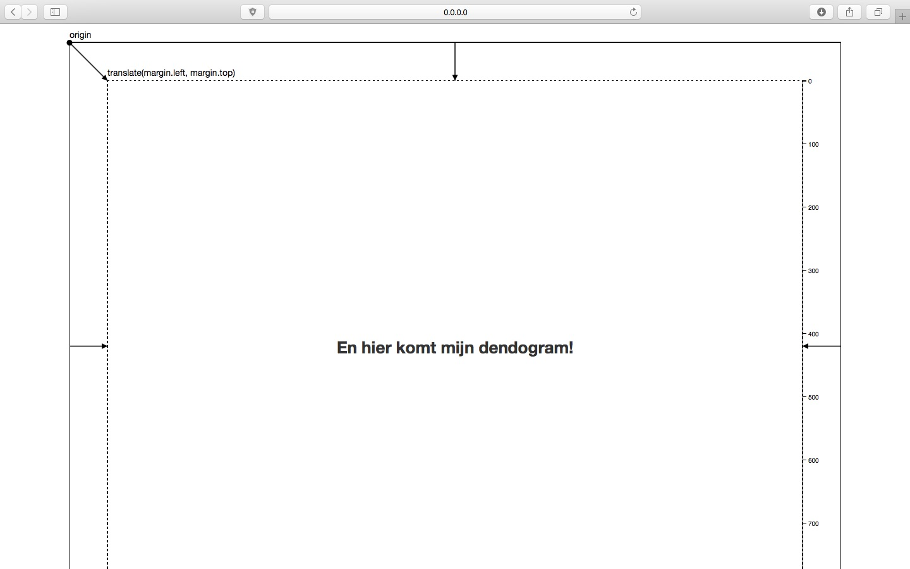

# dag 1 (8/6)

* Gisteravond heb ik mijn datasets wat aangepast: ik neem minder variabelen over het internetgebruik in Nederland. Heb twee extra datasets geimporteert via statline: eentje over politieke interesse en eentje over politieke participatie. Zo sluiten de variabelen van mijn visualisaties beter op elkaar aan.

* Vandaag ga ik beginnen aan de prototype.

* Ik hergebruik mijn bootstrap code van de opdracht Linked Views.

* Er is een werkende navigatiebalk!

* Ik heb twee canvassen aangemaakt voor de drie visualisaties. Ik heb het skelet van de margin convention erbij geimporteert want als iets een struikelblok was en ongelooflijk irritant dan was het padden van visualisaties. Nu zie ik precies waar ik "ben" op mijn website.

* Ik ga nu beginnen aan mijn json data inladen. Om weer even te weten hoe dit ook alweer moest ben ik een tutorial op youtube gaan kijken: https://www.youtube.com/watch?v=duGyc25m9YI&t=415s

# dag 2 (10/6)

* Thuis even werken aan het klaar zetten van mijn data.

# dag 3 (11/6)

* Ga beginnen aan mijn linegraph.

* Was vandaag lang bezig aan mijn linegraph. Heel lang zitten klooien met mijn 'path' want hij kreeg de hele tijd geen data binnen. Uiteindelijk was de oplossing mijn scalefuncties: was vergeten data mee tegeven aan mijn domain. .domain(d3.extent(vertrouwen, function(d) { return d.Periode; })) was eerst .domain(d3.extent(function(d) { return d.Periode; }))

# dag 4 (12/6)

* Ga mijn linegraph verbeteren, hij is nu nog heel ruw:

* Zoals je ziet zijn de lijnen allemaal met elkaar verbonden. Dit zijn nu alle values van vertrouwen in alle mensen van alle bevolkingsgroepen. Ik ga nu proberen 1 lijn te trekken voor migratieachtergrond: totaal. Dan verder met de andere variabelen die in deze linegraph moeten.

* Ik heb ondervonden dat mijn json data structuur niet optimaal is. Ik kan zoals ie nu is niet selecteren op migratieachtergrond. Ik ga hem nu eenpassen zodat na een jsonkey bijvoorbeeld "{vertrouwen":[{ alle variabelen}, ik "{vertrouwen": [{"Westers": {alle variabelen}"" krijg. 
