# dag 1 (8/6)

* Gisteravond heb ik mijn datasets wat aangepast: ik neem minder variabelen over het internetgebruik in Nederland. Heb twee extra datasets geimporteert via statline: eentje over politieke interesse en eentje over politieke participatie. Zo sluiten de variabelen van mijn visualisaties beter op elkaar aan.

* Vandaag ga ik beginnen aan de prototype.

* Ik hergebruik mijn bootstrap code van de opdracht Linked Views.

* Er is een werkende navigatiebalk.

* Ik heb twee canvassen aangemaakt voor de drie visualisaties. Ik heb het skelet van de margin convention erbij geimporteert voor de duidelijkheid qua padding.

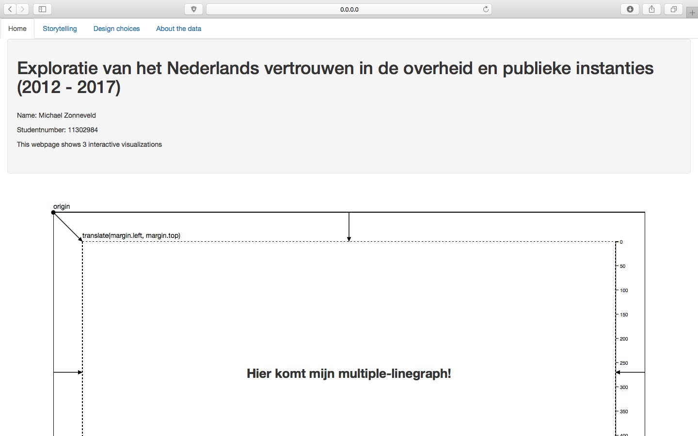

* Ik ga nu beginnen aan mijn json data inladen. Om weer even te weten hoe dit ook alweer moest ben ik een tutorial op youtube gaan kijken: https://www.youtube.com/watch?v=duGyc25m9YI&t=415s

# dag 2 (10/6)

* Thuis even werken aan het klaar zetten van mijn data.

# dag 3 (11/6)

* Ga beginnen aan mijn linegraph.

* Was vandaag lang bezig aan mijn linegraph. Heel lang zitten klooien met mijn 'path' want hij kreeg de hele tijd geen data binnen. Uiteindelijk was de oplossing mijn scalefuncties: was vergeten data mee te geven aan mijn domain. .domain(d3.extent(vertrouwen, function(d) { return d.Periode; })) was eerst .domain(d3.extent(function(d) { return d.Periode; }))

# dag 4 (12/6)

* Ga mijn linegraph verbeteren, hij is nu nog heel ruw:

* Zoals je ziet zijn de lijnen allemaal met elkaar verbonden. Dit zijn nu alle values van vertrouwen in alle mensen van alle bevolkingsgroepen. Ik ga nu proberen 1 lijn te trekken voor migratieachtergrond: totaal. Dan verder met de andere variabelen die in deze linegraph moeten.

* Ik heb ondervonden dat mijn json data structuur niet optimaal is. Ik kan zoals ie nu is niet selecteren op migratieachtergrond. Ik ga hem nu eenpassen zodat na een jsonkey bijvoorbeeld "{vertrouwen":[{ alle variabelen}, ik "{vertrouwen": [{"Westers": [{ 2012 {alle variabelen}"" krijg.

* Ben vandaag tot zover gekomen:

* Morgen ga ik hier een forloop voor maken en dan kan ik het toepassen op mijn andere jsons, en dan kan ik hopelijk door met mijn visualisaties.

# dag 5 (13/6)

* Eindelijk klaar met reconstructie van mijn data 'vertrouwen'. Nu tijd voor mijn linegraph.

* HEEL lang zitten klooien met mijn linegraph, uiteindelijk na heel veel trail and error heb ik een lijn gekregen voor vertrouwen in andere mensen van het totaal onder de bevolkingsgroepen. Key finding was dat ik mijn xScale functie verkeerd had geschreven. De extent functie voor de jaren stond tussen blokhaken. Ik heb nu in mijn path functie nu data.([array van jaren]). Ik snap eigenlijk alleen nog niet zo goed waarom dit hier moet. Ik weet dat het alleen een array accepteert maar dat zou toch ook anders kunnen. Verder had ik de i geimplimenteerd in de anonieme functie van .y in line functie: y((d,i) => yScale(mensenTot[i])). Hierdoor liepen de values parralel met de jaren. Ik heb alleen mijn array van percentages via een hele specifieke for loop gekregen. Dit is onrealistisch als je kijkt naar hoe groot mijn dataset is dus moet hier denk ik een functie voor schrijven zodat het met elke variabele gedaan kan worden.

* Data structuur is helemaal af. Je kan nu van alle jsons alles bereiken met 'naamdataset'.'bevolkingsgroep'.'jaar'

# dag 6 (14/6)

* Line graph al een stuk verder:

* Ga nu basis maken van update functie met dropdown.

* Vandaag update functie afgekregen. Heb deze keer een handleEvent functie gebruikt in tegenstelling tot de vorige opdrachten. Hierdoor heeft het opvullen van arrays met percentages in de makeLinegraph functie geen probleem opgeleverd.

# dag 7 (15/6)

* Vandaag begin maken van dendogram, ben nu eerst het voorbeeld aan het volgen en console.logjes gooien in zijn code om te kijken wat waar gebeurd

# dag 8 (16/6)

* Ben nog niet ver met dendrogram en het lijkt er op dat mijn datastructuur weer niet juist is voor deze visualisatie.

* Ik heb de keuze gemaakt om de variabelen over faciliteiten niet meer te gebruiken omdat de gebruiker anders door de bomen het bos niet meer zien.

# dag 9 (18/6)

* Ga weer verder met mijn dendrogram. Hoop dat ik er een beetje uit kom qua structuur.

* De documentatie van o.a. cluster en hierarchy bekijken: http://d3-wiki.readthedocs.io/zh_CN/master/Cluster-Layout/

* Verschil in datastructuur van root.descendants ten opzichte van mijn voorbeeld:

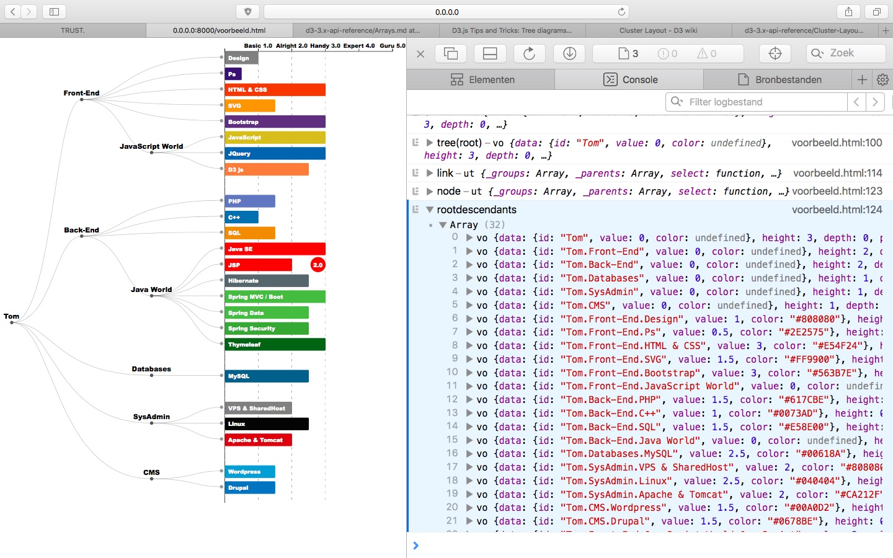

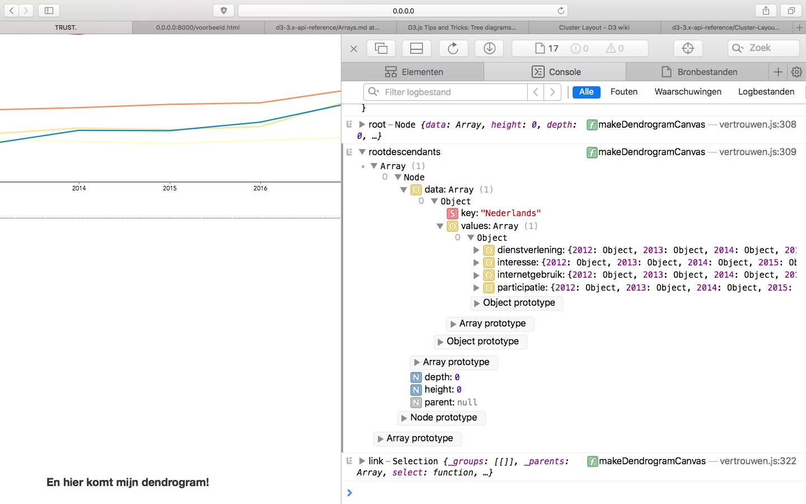

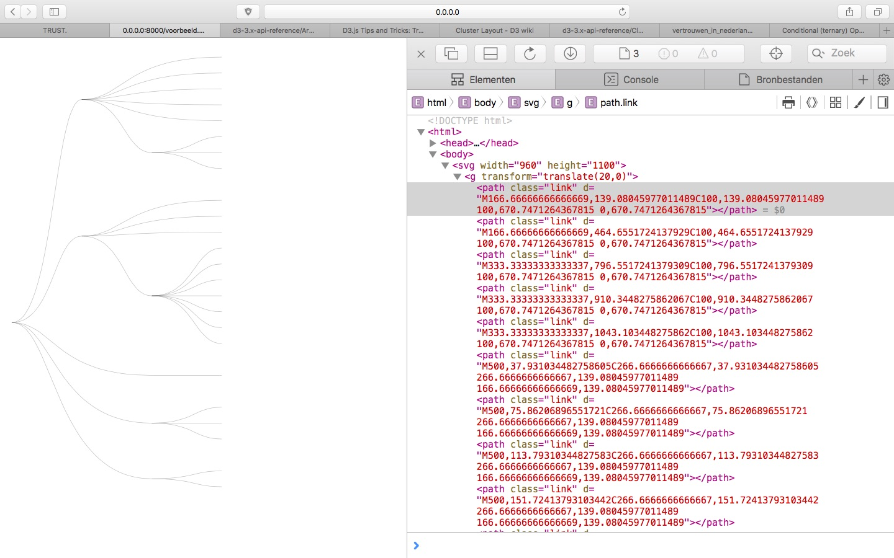

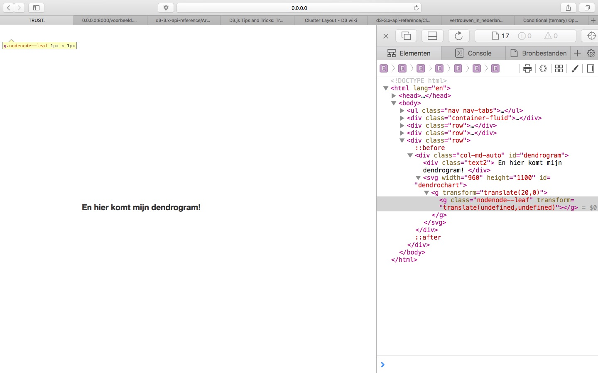

* Hierarchische data structuur bereikt voor 2012 alle nederlanders (zie onderstaande afbeeldingen). moet dit later in een for loop verwerken zodat ik het cross-sectioneel heb voor alle datapunten en bevolkingsgroepen. Nu heb ik een opzet qua data om daadwerkelijk een dendrogram te maken (hopelijk). Dit was eerst niet mogelijk omdat mijn data te "plat" was.

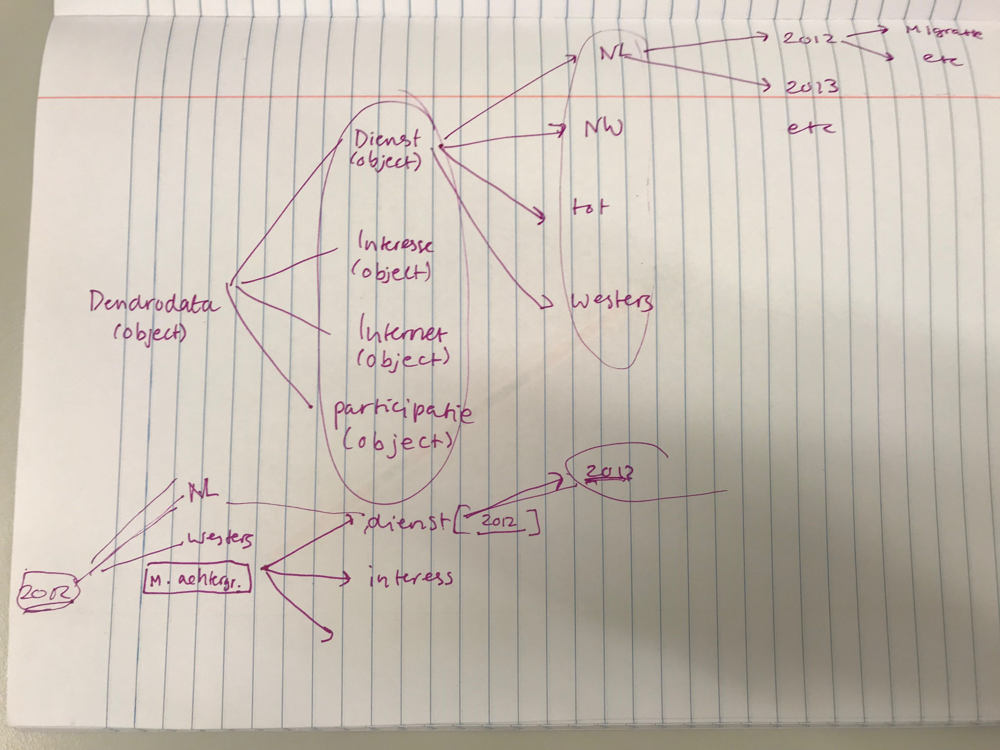
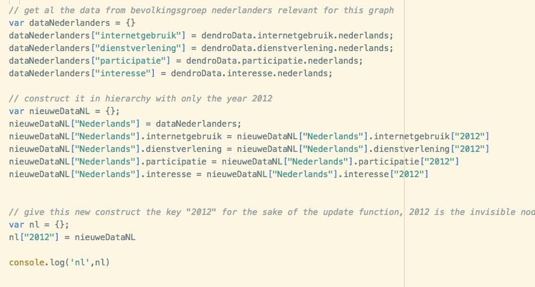

# dag 10 (19/6)

* Moeite met for loop voor data children/parents. wacht even op TA's en ondertussen doe ik wat andere dingen (legenda/crosshair etc.)

* Samen met tim deze for loop geschreven waardoor ik nu echt kan beginnen aan mijn dendro.

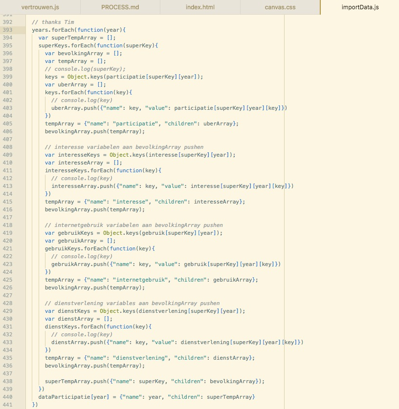

* Ben al een stuk verder met dendrogram alleen staat er nog weining op blad. Wel veel code op basis van voorbeeld maar er is een bug waar ik niet uit kom en dat is dat er geen cirkles worden geplaatst bij de nodes.

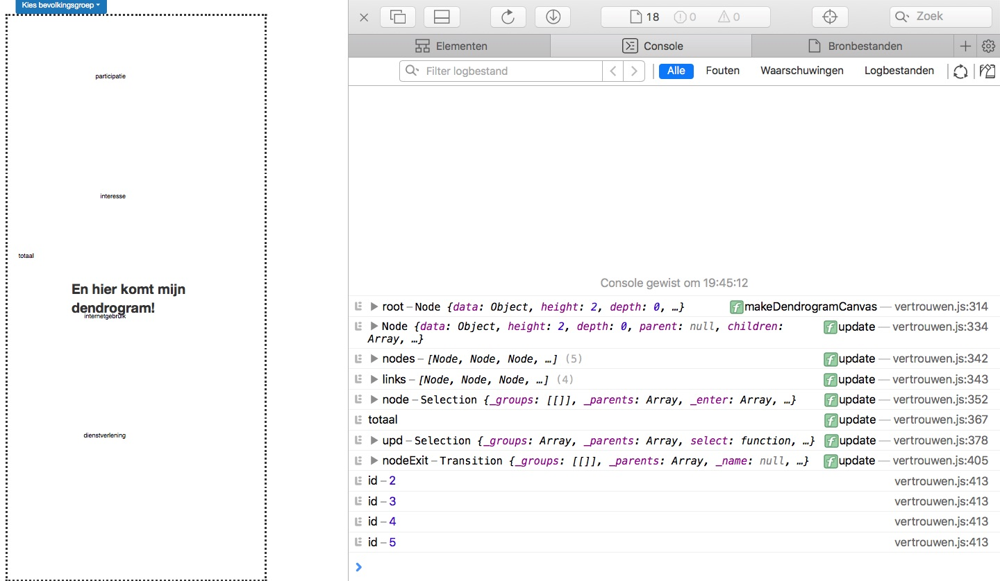

* Al een stuk verder, ga nu proberen rectangles met de waarde van de variabelen erachter te laten appenden.

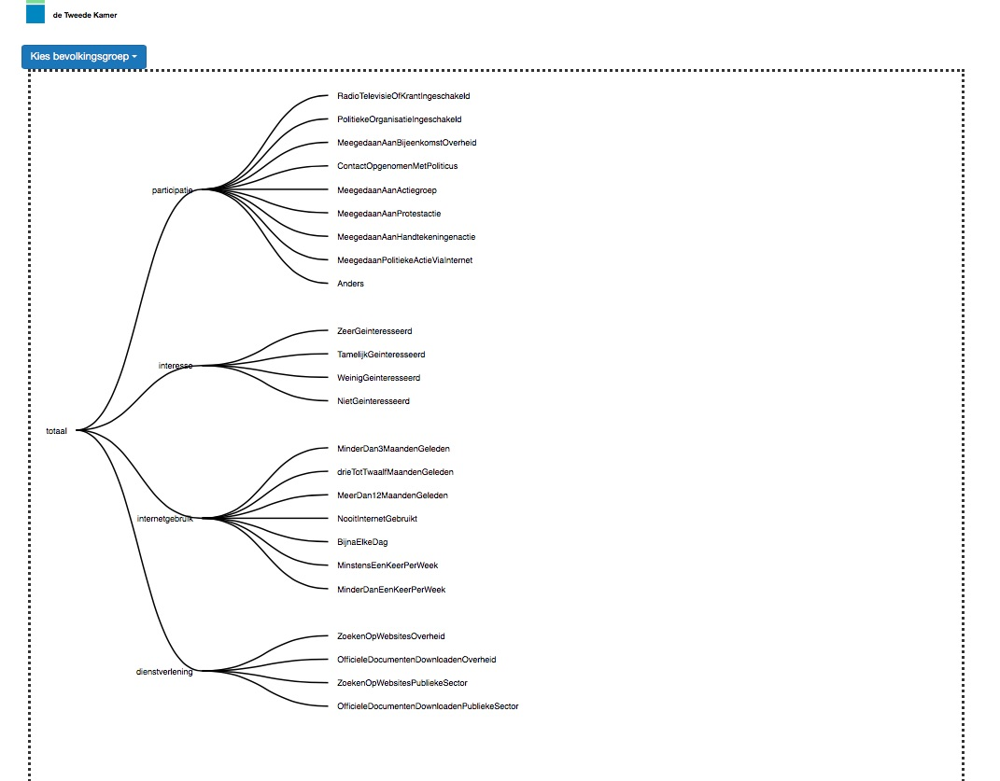

# dag 11 (20/6)

* Ga vandaag zorgen dat er rectangles verschijnen achter de laatste nodes. Eerst gewoon rects. daarna met waardes, en daarna met kleur. Om er achter te komen hoe dit moet ga ik goed naar de code kijken van voorbeeld Dendrogram + Grouped Horizontal Bar Chart op bl.ocks.org.

# dag 12 (21/6)

* I got me some rects:

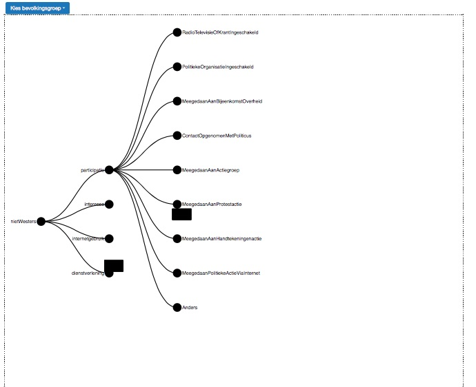

* Rects zijn in principe gelukt, moet alleen nog op juiste positie en scaling met x as. Heb voor de aankomende week een to-do list gemaakt:

# dag 13 (22/6)

* Begin van een update-link functie gemaakt.

# dag 14 (23/6)

* Werken aan de stijling van mijn dendrogram.

* Besloten om de bars te laten verschijnen een stukje verder van de laatste nodes. Mijn plan was eerst om de tekst te laten verschijnen in de bars, en dat de bars meteen kwamen aan de laatste nodes, maar dit lijkt me toch geen goed idee omdat er heel veel lage percentages zijn, en het dan raar oogt voor de gebruiker als er tekst maar voor de helft in een bar verschijnt, of zelfs minder.

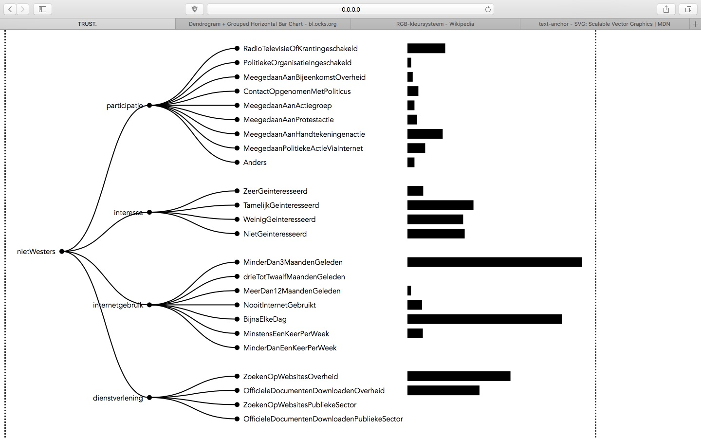

* Ga nu een x-as maken.

# dag 15 (24/6)

* Ga nu ervoor zorgen dat de naam van de geselecteerde bevolkingsgroep in de linechart komt te staan.

* Kwam er achter dat voordat ik die namen in visualisaties kon doen eerst de linked-update functies helemaal goed moest hebben, dus dat heb ik gedaan. Je kan nu een bevolkingsgroep kiezen in dropdown, dan op jaar klikken in linegraph en dan blijft de bevolkingsgroep die eerst gekozen was staan in de dendrogram met het juiste jaar.

* Vandaag veel vooruitgang geboekt:

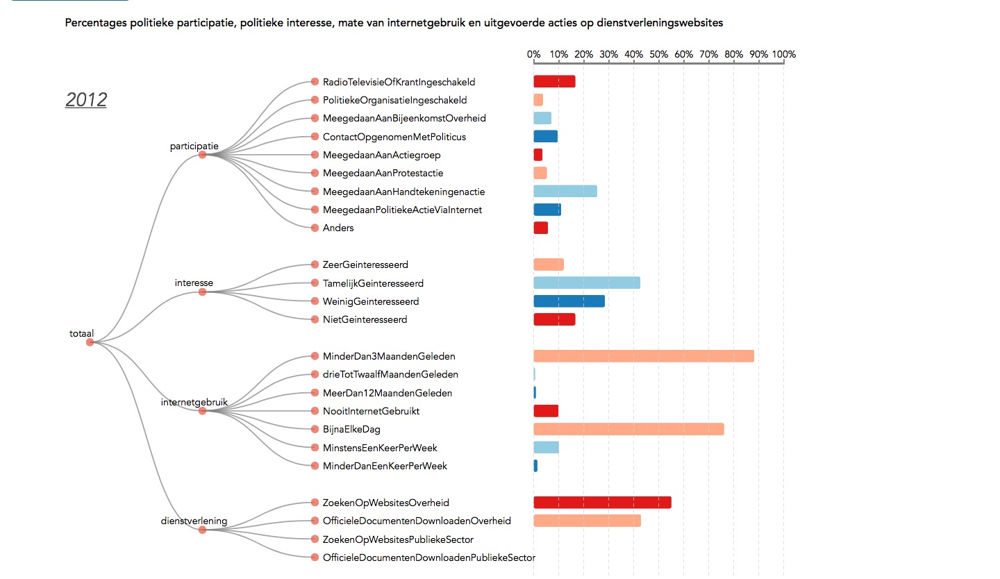

# dag 16

* Op basis van mijn feedback van groepje besloten dat ik de x-assen laat staan voor de bars en niet g proberen om ze erachter te krijgen. Mijn groepsgenoten vonden juist namelijk juist duidelijker:

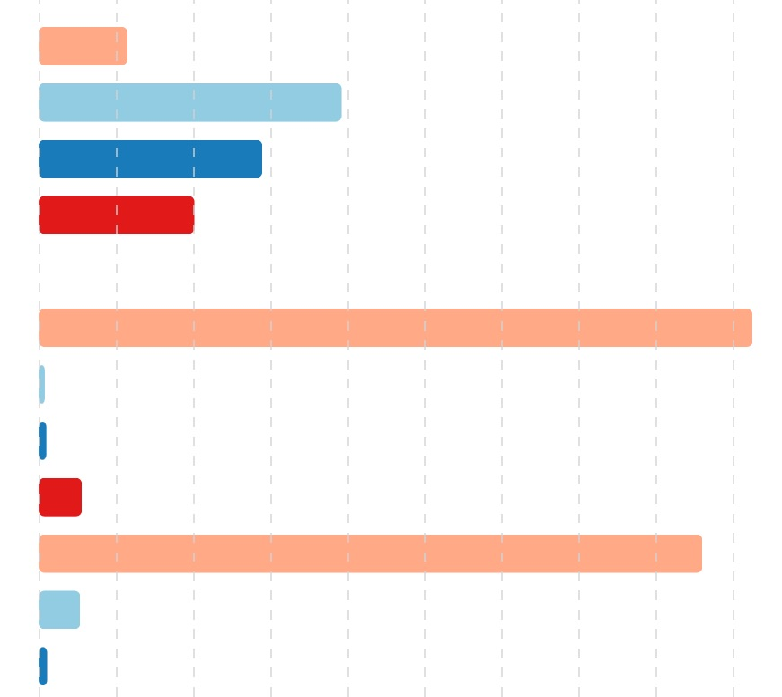

# dag 17

* Zorgen dat checkboxes correct rood gekleurd worden bij het selecteren van een jaar.

* Jaar selectie kleur is rood want dat doet het meest denken aan een markering of het invullen van een rondje.

* Klaar met bovenstaande nu zorgen dat er transitie is in de lijnen. 
